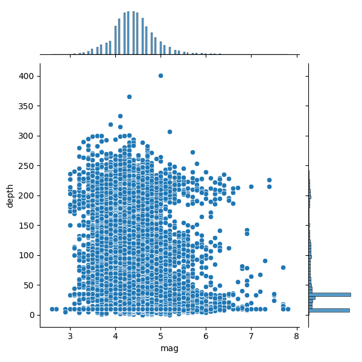
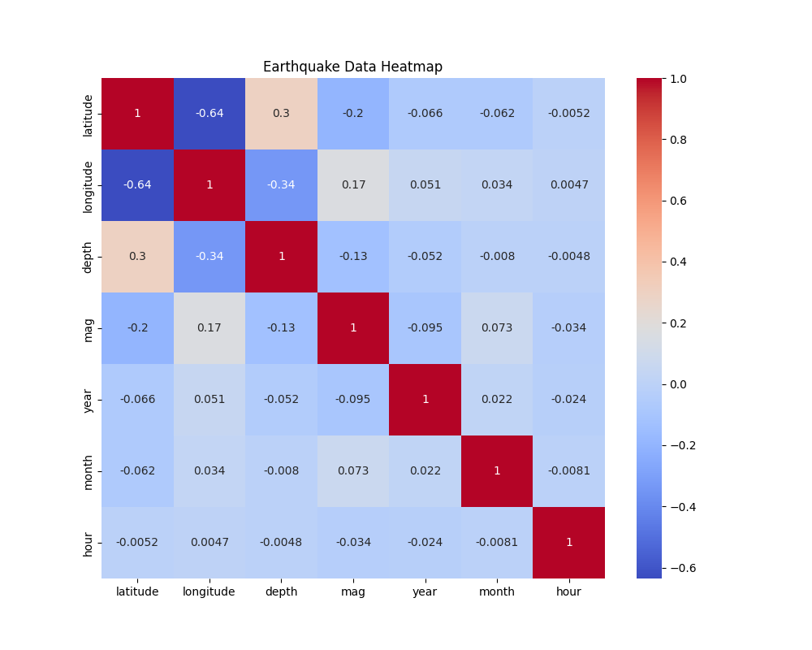
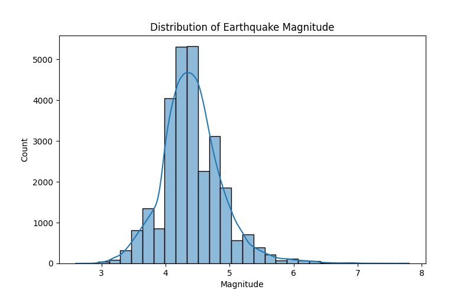
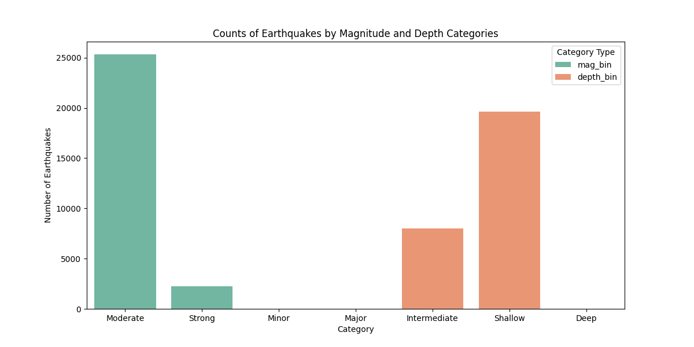
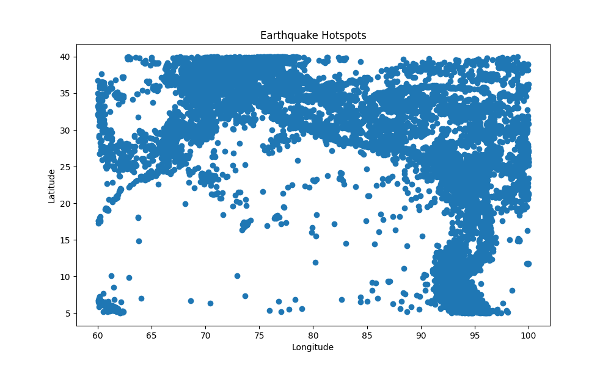
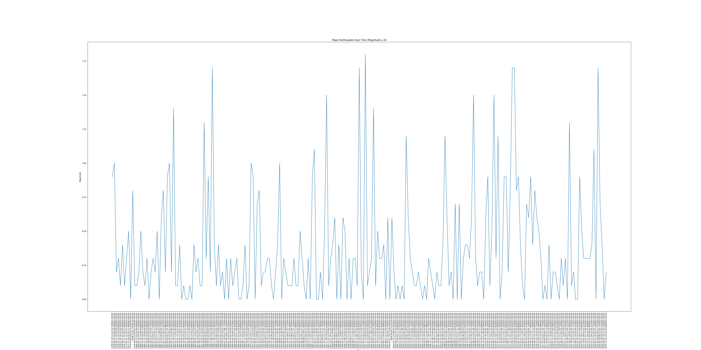
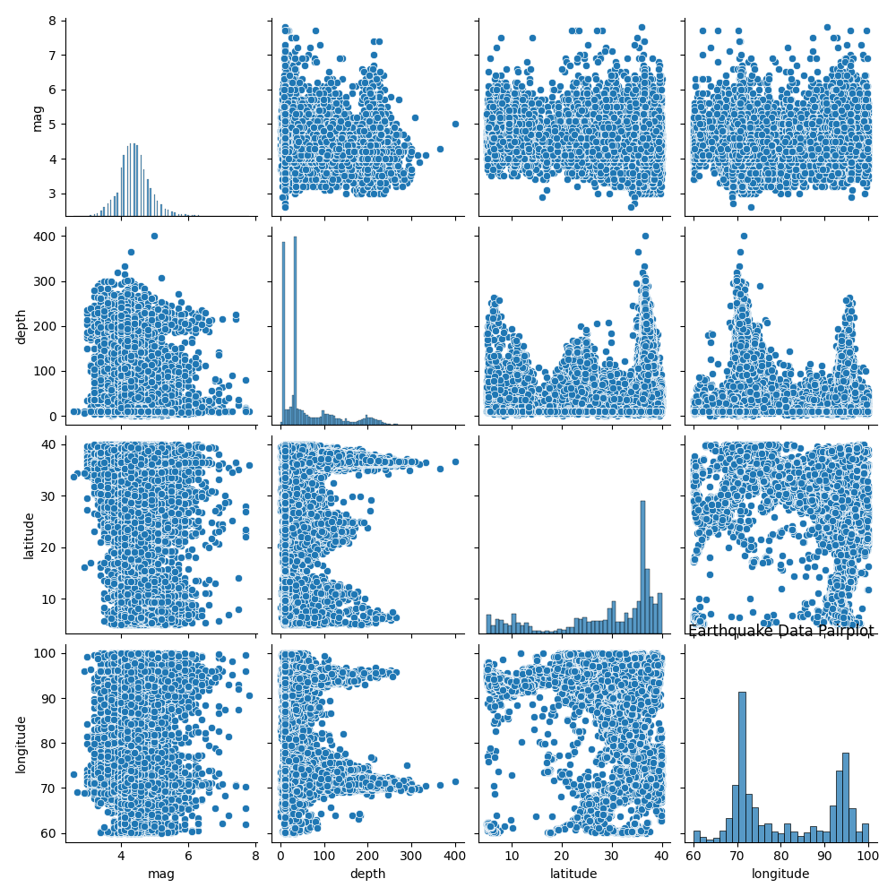

# Earthquake Pattern Visualizer – Visualization Documentation

## Overview
This document records the visualizations created from the cleaned dataset (`earthquakes_cleaned.csv`). Each section explains the purpose of the plot, the method used, and the insights gained.

---

## 1. Magnitude vs Depth

* **Plot Type**: Scatter / Jointplot
* **Purpose**: To explore the relationship between earthquake magnitude and depth.
* **Code Example**:
    ```python
    sns.jointplot(data=df, x="depth", y="mag", kind="scatter", alpha=0.5)
    ```



> **Insights**: Most earthquakes happen at shallow depths (less than 300 km) and with magnitudes between 3 and 6. Very strong quakes above magnitude 7 are rare, and deep earthquakes are less common.

---

## 2. Earthquake Frequency by Year and Month

* **Plot Type**: Heatmap
* **Purpose**: To identify seasonal or yearly patterns in earthquake occurrence.
* **Code Example**:
    ```python
    pivot = df.pivot_table(index="year", columns="month", values="mag", aggfunc="count")
    sns.heatmap(pivot, cmap="Reds", linewidths=0.5)
    ```



> **Insights**: Most variables don’t have strong relationships with each other. The clearest pattern is that latitude and longitude are strongly linked (because they describe location). Depth shows a weak positive link with latitude, meaning deeper quakes are slightly more common in certain regions. Magnitude has very little correlation with other factors, which suggests earthquake strength is mostly independent of time or place.

---

## 3. Magnitude Distribution

* **Plot Type**: Histogram
* **Purpose**: To show how earthquake magnitudes are distributed.
* **Code Example**:
    ```python
    sns.histplot(df["mag"], bins=30, kde=True)
    ```



> **Insights**: Most earthquakes happen around magnitude 4 to 5. The curve shows this is the peak range where quakes are most frequent. As the magnitude gets higher, earthquakes become less and less common, and very strong ones above 7 are rare.

---

## 4. Counts by Magnitude and Depth Categories

* **Plot Type**: Bar Plot
* **Purpose**: To compare frequency of quakes across bins.
* **Code Example**:
    ```python
    sns.countplot(data=df, x="mag_bin")
    sns.countplot(data=df, x="depth_bin")
    ```



> **Insights**: 
> * **For Magnitude**: Most earthquakes are Moderate (between magnitude 3 and 5). Strong quakes are much fewer, and Minor or Major ones are very rare. This shows that earthquakes usually fall in the middle range of strength, while extreme ones are uncommon.
> * **For Depth**: Most earthquakes happen at Shallow depths (less than 70 km). Intermediate quakes occur less often, and Deep ones are almost absent. This means earthquakes usually strike close to the Earth’s surface.

---

## 5. Geographic Hotspots

* **Plot Type**: Scatter Map (Latitude vs Longitude)
* **Purpose**: To visualize earthquake locations and identify clusters.
* **Code Example**:
    ```python
    plt.scatter(df["longitude"], df["latitude"], c=df["mag"], cmap="Reds", alpha=0.5)
    ```



> **Insights**: Earthquakes are not spread evenly. They cluster in certain areas, showing clear hotspots. These clusters mark regions where earthquakes happen more often, usually along tectonic boundaries.

---

## 6. Timeline of Major Quakes

* **Plot Type**: Line Plot / Timeline
* **Purpose**: To highlight major earthquakes over 50 years.
* **Code Example**:
    ```python
    major_quakes = df[df["mag"] >= 6.5]
    plt.plot(major_quakes["time"], major_quakes["mag"], "o")
    ```



> **Insights**: Big earthquakes (magnitude 6 and above) keep happening again and again over the years. The line shows that their strength goes up and down, but there is no long break — major quakes appear regularly. This means strong earthquakes are part of a repeating pattern in history, not one‑time events.

---

## 7. Pairplot of Earthquake Variables

* **Plot Type**: Pairplot (scatter + histograms)
* **Purpose**: To examine distributions and relationships among multiple variables at once.
* **Code Example**:
    ```python
    sns.pairplot(df[["mag", "depth", "latitude", "longitude"]])
    ```



> **Insights**: The pairplot shows that most earthquakes are moderate in magnitude and shallow in depth. Latitude and longitude scatter plots reveal clusters, meaning earthquakes concentrate in certain regions. Overall, magnitude doesn’t show a strong link with depth or location, but the plots confirm clear geographic hotspots.

---

# Summary:

The visualizations reveal consistent patterns in earthquake behavior:

* **Magnitude vs Depth**: Most earthquakes are shallow (less than 300 km) and moderate in strength (magnitude 3–6). Strong quakes can occur at different depths, showing that depth does not strongly control magnitude.
* **Frequency by Year/Month (Heatmap)**: Earthquake variables show weak correlations overall. Location (latitude/longitude) is the strongest link, while magnitude remains largely independent of time or place.
* **Magnitude Distribution (Histogram)**: Earthquakes most often occur around magnitude 4–5. Very strong quakes (above 7) are rare.
* **Counts by Categories (Bar Plots)**: Moderate earthquakes dominate, while Minor, Major, and Strong ones are much fewer. Shallow earthquakes are most common, with Intermediate less frequent and Deep ones almost absent.
* **Geographic Hotspots (Scatter Plot)**: Earthquakes cluster in specific regions, highlighting seismic hotspots along tectonic boundaries.
* **Timeline of Major Quakes**: Strong earthquakes (≥6) appear regularly over time, with varying strength, showing that major quakes are recurring events rather than isolated incidents.
* **Pairplot (Multi-variable Overview)**: The pairplot confirms that magnitude and depth distributions are skewed toward moderate and shallow values. Latitude and longitude scatter plots reveal clusters, reinforcing the hotspot pattern. Magnitude shows little correlation with depth or location, emphasizing its independence.

📌 **Key Takeaway**
> Earthquakes are usually moderate in strength and shallow in depth, concentrated in specific geographic hotspots, and major quakes recur regularly over time. The pairplot strengthens these findings by showing distributions and relationships together, confirming that while location drives clustering, earthquake strength is largely independent.